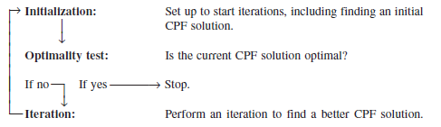

We now are ready to begin studying the simplex method, a general procedure for solving linear programming problems. Developed by George Dantzig in 1947, it has proved to be a remarkably efficient method that is used routinely to solve huge problems on today’s computers. Except for its use on tiny problems, this method is always executed on a computer, and sophisticated software packages are widely available. Extensions and variations of the simplex method also are used to perform postoptimality analysis (including sensitivity analysis) on the model.

This chapter describes and illustrates the main features of the simplex method. The first section introduces its general nature, including its geometric interpretation. The following three sections then develop the procedure for solving any linear programming model that is in our standard form (maximization, all functional constraints in  form, and nonnegativity constraints on all variables) and has only nonnegative right-hand sides bi in the functional constraints. Certain details on resolving ties are deferred to Sec. 4.5, and Sec. 4.6 describes how to adapt the simplex method to other model forms. Next we discuss postoptimality analysis (Sec. 4.7), and describe the computer implementation of the simplex method (Sec. 4.8). Section 4.9 then introduces an alternative to the simplex method (the interior-point approach) for solving large linear programming problems.

이제 선형 계획법 문제를 해결하기 위한 일반적인 절차인 심플렉스 방법을 연구할 준비가 되었습니다. 1947년 George Dantzig가 개발한 이 방법은 오늘날 컴퓨터의 거대한 문제를 해결하기 위해 일상적으로 사용되는 매우 효율적인 방법임이 입증되었습니다. 작은 문제에 사용되는 것을 제외하면 이 방법은 항상 컴퓨터에서 실행되며 정교한 소프트웨어 패키지가 널리 사용됩니다. 단순 방법의 확장 및 변형은 모델에 대한 사후 최적성 분석(민감도 분석 포함)을 수행하는 데에도 사용됩니다.

이 장에서는 단순 방법의 주요 기능을 설명하고 설명합니다. 첫 번째 섹션에서는 기하학적 해석을 포함하여 일반적인 특성을 소개합니다. 다음 세 섹션에서는 표준 형식(최대화, 형식의 모든 함수 제약 조건, 모든 변수에 대한 비음성 제약 조건)을 갖고 함수 제약 조건에 음이 아닌 오른쪽 bi만 있는 선형 프로그래밍 모델을 해결하기 위한 절차를 개발합니다. . 관계 해결에 대한 특정 세부 사항은 Sec. 4.5 및 초. 4.6에서는 단순 방법을 다른 모델 형식에 적용하는 방법을 설명합니다. 다음으로 우리는 사후 최적 분석(섹션 4.7)에 대해 논의하고 단순 방법(섹션 4.8)의 컴퓨터 구현을 설명합니다. 그런 다음 섹션 4.9에서는 대규모 선형 프로그래밍 문제를 해결하기 위한 단순 방법(내부 점 접근 방식)에 대한 대안을 소개합니다.

THE ESSENCE OF THE SIMPLEX METHOD

The simplex method is an algebraic procedure. However, its underlying concepts are geometric. Understanding these geometric concepts provides a strong intuitive feeling for how the simplex method operates and what makes it so efficient. Therefore, before delving into algebraic details, we focus in this section on the big picture from a geometric viewpoint. To illustrate the general geometric concepts, we shall use the Wyndor Glass Co. example presented in Sec. 3.1. (Sections 4.2 and 4.3 use the algebra of the simplex method to solve this same example.) Section 5.1 will elaborate further on these geometric concepts for larger problems.

To refresh your memory, the model and graph for this example are repeated in Fig. 4.1. The five constraint boundaries and their points of intersection are highlighted in this figure because they are the keys to the analysis. Here, each constraint boundary is a line that forms the boundary of what is permitted by the corresponding constraint. The points of intersection are the corner-point solutions of the problem. The five that lie on the corners of the feasible region—(0, 0), (0, 6), (2, 6), (4, 3), and (4, 0)—are the corner-point feasible solutions (CPF solutions). [The other three—(0, 9), (4, 6), and (6, 0)—are called corner-point infeasible solutions.] In this example, each corner-point solution lies at the intersection of two constraint boundaries. (For a linear programming problem with n decision variables, each of its corner-point solutions lies at the intersection of n constraint boundaries.1) Certain pairs of the CPF solutions in Fig. 4.1 share a constraint boundary, and other pairs do not. It will be important to distinguish between these cases by using the following general definitions.

SIMPLEX 방법의 본질

심플렉스 방법은 대수적 절차입니다. 그러나 기본 개념은 기하학적입니다. 이러한 기하학적 개념을 이해하면 단순 방법이 어떻게 작동하고 무엇이 이를 그렇게 효율적으로 만드는지에 대한 강력한 직관적 느낌을 얻을 수 있습니다. 따라서 대수학의 세부 사항을 탐구하기 전에 이 섹션에서는 기하학적 관점의 큰 그림에 중점을 둡니다. 일반적인 기하학적 개념을 설명하기 위해 Sec.에 제시된 Wyndor Glass Co.의 예를 사용합니다. 3.1. (4.2절과 4.3절에서는 동일한 예를 풀기 위해 단체법의 대수학을 사용합니다.) 5.1절에서는 더 큰 문제에 대한 이러한 기하학적 개념에 대해 더 자세히 설명합니다.

기억을 되살리기 위해 이 예의 모델과 그래프가 그림 4.1에 반복되어 있습니다. 5개의 구속조건 경계와 교차점은 분석의 핵심이므로 이 그림에서 강조 표시됩니다. 여기서 각 제약 경계는 해당 제약이 허용하는 경계를 형성하는 선입니다. 교차점은 문제의 모퉁이점 솔루션입니다. 실현 가능 영역의 모서리에 있는 5개((0, 0), (0, 6), (2, 6), (4, 3) 및 (4, 0))는 모서리 점 실현 가능 솔루션입니다. (CPF 솔루션). [나머지 세 개((0, 9), (4, 6) 및 (6, 0))는 꼭지점 실현 불가능 솔루션이라고 합니다.] 이 예에서 각 꼭지점 솔루션은 두 제약 조건 경계의 교차점에 있습니다. . (n개의 결정 변수가 있는 선형 계획법 문제의 경우 각 꼭지점 해는 n개의 제약 경계의 교차점에 있습니다.1) 그림 4.1의 특정 CPF 해 쌍은 제약 경계를 공유하고 다른 쌍은 공유하지 않습니다. 다음의 일반적인 정의를 사용하여 이러한 경우를 구별하는 것이 중요합니다.

For any linear programming problem with n decision variables, two CPF solutions are adjacent to each other if they share n = 1 constraint boundaries. The two adjacent CPF solutions are connected by a line segment that lies on these same shared constraint boundaries. Such a line segment is referred to as an edge of the feasible region.

n개의 결정 변수가 있는 선형 계획법 문제의 경우 두 개의 CPF 솔루션이 n = 1 제약 경계를 공유하는 경우 서로 인접해 있습니다. 인접한 두 CPF 솔루션은 동일한 공유 제약 경계에 있는 선분으로 연결됩니다. 이러한 선분을 실현 가능 영역의 모서리라고 합니다.

Since n = 2 in the example, two of its CPF solutions are adjacent if they share one constraint boundary; for example, (0, 0) and (0, 6) are adjacent because they share the x1 = 0 constraint boundary. The feasible region in Fig. 4.1 has five edges, consisting of the five line segments forming the boundary of this region. Note that two edges emanate from each CPF solution. Thus, each CPF solution has two adjacent CPF solutions (each lying at the other end of one of the two edges), as enumerated in Table 4.1. (In each row of this table, the CPF solution in the first column is adjacent to each of the two CPF solutions in the second column, but the two CPF solutions in the second column are not adjacent to each other.)

One reason for our interest in adjacent CPF solutions is the following general property about such solutions, which provides a very useful way of checking whether a CPF solution is an optimal solution.\

예제에서 n = 2이므로 CPF 솔루션 중 두 개가 하나의 제약 경계를 공유하는 경우 인접합니다. 예를 들어, (0, 0)과 (0, 6)은 x1 = 0 제약 경계를 공유하기 때문에 인접합니다. 그림 4.1의 실현 가능 영역에는 이 영역의 경계를 형성하는 5개의 선분으로 구성된 5개의 모서리가 있습니다. 각 CPF 솔루션에서 두 개의 에지가 발생합니다. 따라서 각 CPF 솔루션에는 표 4.1에 열거된 것처럼 두 개의 인접한 CPF 솔루션(각각은 두 가장자리 중 하나의 다른 쪽 끝에 있음)이 있습니다. (이 표의 각 행에서 첫 번째 열의 CPF 솔루션은 두 번째 열의 두 CPF 솔루션 각각에 인접해 있지만, 두 번째 열의 두 CPF 솔루션은 서로 인접하지 않습니다.)

인접한 CPF 솔루션에 관심을 갖는 한 가지 이유는 해당 솔루션에 대한 다음과 같은 일반적인 속성으로, 이는 CPF 솔루션이 최적 솔루션인지 확인하는 매우 유용한 방법을 제공합니다.

Optimality test: Consider any linear programming problem that possesses at least one optimal solution. If a CPF solution has no adjacent CPF solutions that are better (as measured by Z), then it must be an optimal solution.

최적성 테스트: 하나 이상의 최적 솔루션이 있는 선형 프로그래밍 문제를 고려합니다. CPF 솔루션에 더 나은(Z로 측정) 인접한 CPF 솔루션이 없으면 최적 솔루션이어야 합니다.

Thus, for the example, (2, 6) must be optimal simply because its Z = 36 is larger than Z = 30 for (0, 6) and Z = 27 for (4, 3). (We will delve further into why this property holds in Sec. 5.1.) This optimality test is the one used by the simplex method for determining when an optimal solution has been reached.

Now we are ready to apply the simplex method to the example.

따라서 예를 들어 (2, 6)은 Z = 36이 (0, 6)의 경우 Z = 30보다 크고 (4, 3)의 경우 Z = 27이기 때문에 최적이어야 합니다. (이 속성이 왜 섹션 5.1에서 유지되는지 자세히 알아볼 것입니다.) 이 최적성 테스트는 언제 최적의 솔루션에 도달했는지 결정하기 위해 단순 방법에서 사용되는 테스트입니다.

이제 예제에 Simplex 방법을 적용할 준비가 되었습니다.

Solving the Example

Here is an outline of what the simplex method does (from a geometric viewpoint) to solve the Wyndor Glass Co. problem. At each step, first the conclusion is stated and then the reason is given in parentheses. (Refer to Fig. 4.1 for a visualization.)

Initialization: Choose (0, 0) as the initial CPF solution to examine. (This is a convenient choice because no calculations are required to identify this CPF solution.)

Optimality Test: Conclude that (0, 0) is not an optimal solution. (Adjacent CPF solutions are better.)

Iteration 1: Move to a better adjacent CPF solution, (0, 6), by performing the following three steps.

예제 해결

다음은 Wyndor Glass Co. 문제를 해결하기 위해 심플렉스 방법(기하학적 관점에서)이 수행하는 작업에 대한 개요입니다. 각 단계에서 먼저 결론을 기술하고 그 이유를 괄호 안에 기술한다. (시각화는 그림 4.1을 참조하십시오.)

초기화: 검사할 초기 CPF 솔루션으로 (0, 0)을 선택합니다. (이 CPF 솔루션을 식별하는 데 계산이 필요하지 않기 때문에 이는 편리한 선택입니다.)

최적성 테스트: (0, 0)이 최적 솔루션이 아니라는 결론을 내립니다. (인접한 CPF 솔루션이 더 좋습니다.)

반복 1: 다음 세 단계를 수행하여 더 나은 인접 CPF 솔루션(0, 6)으로 이동합니다.

1. Considering the two edges of the feasible region that emanate from (0, 0), choose to move along the edge that leads up the x2 axis. (With an objective function of Z = 3x1 + 5x2, moving up the x2 axis increases Z at a faster rate than moving along the x1 axis.)

2. Stop at the first new constraint boundary: 2x2 = 12. [Moving farther in the direction selected in step 1 leaves the feasible region; e.g., moving to the second new constraint boundary hit when moving in that direction gives (0, 9), which is a corner-point infeasible solution.]

1. (0, 0)에서 나오는 실현 가능 영역의 두 모서리를 고려하여 x2 축 위로 이어지는 모서리를 따라 이동하도록 선택합니다. (Z = 3x1 + 5x2의 목적 함수를 사용하면 x2 축을 위로 이동하면 x1 축을 따라 이동하는 것보다 더 빠른 속도로 Z가 증가합니다.)

2. 첫 번째 새 제약 경계인 2x2 = 12에서 중지합니다. [1단계에서 선택한 방향으로 더 멀리 이동하면 실행 가능한 영역이 남습니다. 예를 들어, 해당 방향으로 이동할 때 두 번째 새로운 제약 조건 경계 적중으로 이동하면 (0, 9)가 제공되며 이는 실현 불가능한 코너 포인트 솔루션입니다.]

3. Solve for the intersection of the new set of constraint boundaries: (0, 6). (The equations for these constraint boundaries, x1 = 0 and 2x2 = 12, immediately yield this solution.)

3. 새로운 제약 경계 세트(0, 6)의 교차점을 해결합니다. (이러한 제약 경계에 대한 방정식 x1 = 0 및 2x2 = 12는 즉시 이 솔루션을 산출합니다.)

Optimality Test: Conclude that (0, 6) is not an optimal solution. (An adjacent CPF solution is better.)
Iteration 2: Move to a better adjacent CPF solution, (2, 6), by performing the following three steps.

최적성 테스트: (0, 6)이 최적 솔루션이 아니라는 결론을 내립니다. (인접한 CPF 솔루션이 더 좋습니다.)
반복 2: 다음 세 단계를 수행하여 더 나은 인접 CPF 솔루션(2, 6)으로 이동합니다.

1. Considering the two edges of the feasible region that emanate from (0, 6), choose to move along the edge that leads to the right. (Moving along this edge increases Z, whereas backtracking to move back down the x2 axis decreases Z.)

2. Stop at the first new constraint boundary encountered when moving in that direction: 3x1 + 2x2 = 12. (Moving farther in the direction selected in step 1 leaves the feasible region.)

3. Solve for the intersection of the new set of constraint boundaries: (2, 6). (The equations for these constraint boundaries, 3x1 + 2x2 = 18 and 2x2 = 12, immediately yield this solution.)

1. (0, 6)에서 나오는 실현 가능 영역의 두 모서리를 고려하여 오른쪽으로 이어지는 모서리를 따라 이동하도록 선택합니다. (이 가장자리를 따라 이동하면 Z가 증가하는 반면, x2 축 아래로 다시 이동하기 위해 역추적하면 Z가 감소합니다.)

2. 해당 방향으로 이동할 때 만나는 첫 번째 새로운 제약 경계(3x1 + 2x2 = 12)에서 중지합니다. (1단계에서 선택한 방향으로 더 멀리 이동하면 실행 가능한 영역이 남습니다.)

3. 새로운 제약 경계 세트(2, 6)의 교차점을 해결합니다. (이러한 제약 경계에 대한 방정식인 3x1 + 2x2 = 18 및 2x2 = 12는 즉시 이 솔루션을 산출합니다.)

Optimality Test: Conclude that (2, 6) is an optimal solution, so stop. (None of the adjacent CPF solutions are better.)

This sequence of CPF solutions examined is shown in Fig. 4.2, where each circled number identifies which iteration obtained that solution.

Now let us look at the six key solution concepts of the simplex method that provide the rationale behind the above steps. (Keep in mind that these concepts also apply for solving problems with more than two decision variables where a graph like Fig. 4.2 is not available to help quickly find an optimal solution.)

최적성 테스트: (2, 6)이 최적의 솔루션이라고 결론을 내리므로 중지합니다. (인접한 CPF 솔루션 중 더 나은 솔루션은 없습니다.)

조사된 CPF 솔루션의 순서는 그림 4.2에 표시되어 있으며, 여기서 원 안의 각 숫자는 해당 솔루션을 얻은 반복을 식별합니다.

이제 위 단계의 근거를 제공하는 단순 방법의 6가지 핵심 솔루션 개념을 살펴보겠습니다. (이러한 개념은 최적의 솔루션을 빠르게 찾는 데 도움이 되는 그림 4.2와 같은 그래프를 사용할 수 없는 두 개 이상의 결정 변수가 있는 문제를 해결하는 데에도 적용된다는 점을 명심하세요.)

The Key Solution Concepts

The first solution concept is based directly on the relationship between optimal solutions and CPF solutions given at the end of Sec. 3.2.

첫 번째 솔루션 개념은 Sec의 끝 부분에 제공된 최적 솔루션과 CPF 솔루션 간의 관계를 직접 기반으로 합니다. 3.2.

Solution concept 1: The simplex method focuses solely on CPF solutions. For any problem with at least one optimal solution, finding one requires only finding a best CPF solution.1

Since the number of feasible solutions generally is infinite, reducing the number of solutions that need to be examined to a small finite number ( just three in Fig. 4.2) is a tremendous simplification.

The next solution concept defines the flow of the simplex method.

솔루션 개념 1: 단순 방법은 CPF 솔루션에만 중점을 둡니다. 하나 이상의 최적 솔루션이 있는 문제의 경우 하나를 찾으려면 최상의 CPF 솔루션만 찾으면 됩니다.1

실행 가능한 솔루션의 수는 일반적으로 무한하므로 검사해야 하는 솔루션의 수를 작은 유한 수(그림 4.2에서는 단 3개)로 줄이는 것은 엄청난 단순화입니다.

다음 솔루션 개념은 단순 방법의 흐름을 정의합니다.

Solution concept 2: The simplex method is an iterative algorithm (a systematic solution procedure that keeps repeating a fixed series of steps, called an iteration, until a desired result has been obtained) with the following structure.

해결 개념 2: 심플렉스 방법은 다음과 같은 구조를 갖는 반복 알고리즘(원하는 결과를 얻을 때까지 반복이라고 하는 고정된 일련의 단계를 계속 반복하는 체계적인 해결 절차)입니다.

When the example was solved, note how this flow diagram was followed through two iterations until an optimal solution was found.

We next focus on how to get started.

Solution concept 3: Whenever possible, the initialization of the simplex method chooses the origin (all decision variables equal to zero) to be the initial CPF solution. When there are too many decision variables to find an initial CPF solution graphically, this choice eliminates the need to use algebraic procedures to find and solve for an initial CPF solution.

예제가 해결되면 최적의 솔루션을 찾을 때까지 두 번의 반복을 통해 이 흐름도를 어떻게 따랐는지 확인하세요.

다음으로 시작하는 방법에 중점을 둡니다.

솔루션 개념 3: 가능할 때마다 단순 방법의 초기화는 초기 CPF 솔루션으로 원점(모든 결정 변수가 0과 같음)을 선택합니다. 초기 CPF 솔루션을 그래픽으로 찾기에 너무 많은 결정 변수가 있는 경우 이 선택을 사용하면 초기 CPF 솔루션을 찾고 해결하기 위해 대수적 절차를 사용할 필요가 없습니다.

Choosing the origin commonly is possible when all the decision variables have nonnegativity constraints, because the intersection of these constraint boundaries yields the origin as a corner-point solution. This solution then is a CPF solution unless it is infeasible because it violates one or more of the functional constraints. If it is infeasible, special procedures described in Sec. 4.6 are needed to find the initial CPF solution. The next solution concept concerns the choice of a better CPF solution at each iteration.

Solution concept 4: Given a CPF solution, it is much quicker computationally to gather information about its adjacent CPF solutions than about other CPF solutions. Therefore, each time the simplex method performs an iteration to move from the current CPF solution to a better one, it always chooses a CPF solution that is adjacent to the current one. No other CPF solutions are considered. Consequently, the entire path followed to eventually reach an optimal solution is along the edges of the feasible region.

모든 결정 변수에 음이 아닌 제약 조건이 있는 경우 일반적으로 원점을 선택하는 것이 가능합니다. 이러한 제약 조건 경계의 교차점은 원점을 꼭지점 솔루션으로 생성하기 때문입니다. 이 솔루션은 하나 이상의 기능 제약 조건을 위반하여 실행 가능하지 않는 한 CPF 솔루션입니다. 실행 불가능한 경우 Sec. 초기 CPF 솔루션을 찾으려면 4.6이 필요합니다. 다음 솔루션 개념은 각 반복에서 더 나은 CPF 솔루션을 선택하는 것과 관련이 있습니다.

솔루션 개념 4: CPF 솔루션이 주어지면 다른 CPF 솔루션보다 인접한 CPF 솔루션에 대한 정보를 수집하는 것이 계산적으로 훨씬 빠릅니다. 따라서 단순 방법은 현재 CPF 솔루션에서 더 나은 솔루션으로 이동하기 위해 반복을 수행할 때마다 항상 현재 CPF 솔루션에 인접한 CPF 솔루션을 선택합니다. 다른 CPF 솔루션은 고려되지 않습니다. 결과적으로 최적의 솔루션에 도달하기 위해 따르는 전체 경로는 실현 가능 영역의 가장자리를 따릅니다.

The next focus is on which adjacent CPF solution to choose at each iteration.

Solution concept 5: After the current CPF solution is identified, the simplex method examines each of the edges of the feasible region that emanate from this CPF solution. Each of these edges leads to an adjacent CPF solution at the other end, but the simplex method does not even take the time to solve for the adjacent CPF solution. Instead, it simply identifies the rate of improvement in Z that would be obtained by moving along the edge. Among the edges with a positive rate of improvement in Z, it then chooses to move along the one with the largest rate of improvement in Z. The iteration is completed by first solving for the adjacent CPF solution at the other end of this one edge and then relabeling this adjacent CPF solution as the current CPF solution for the optimality test and (if needed) the next iteration.

다음 초점은 각 반복에서 선택할 인접 CPF 솔루션입니다.

솔루션 개념 5: 현재 CPF 솔루션이 식별된 후 단순 방법은 이 CPF 솔루션에서 나오는 실현 가능 영역의 각 가장자리를 검사합니다. 이러한 각 모서리는 다른 쪽 끝에서 인접한 CPF 솔루션으로 연결되지만 단순 방법은 인접한 CPF 솔루션을 해결하는 데 시간이 걸리지 않습니다. 대신, 가장자리를 따라 이동하여 얻을 수 있는 Z 개선율을 간단히 식별합니다. Z에서 양의 개선률을 갖는 모서리 중에서 Z에서 가장 큰 개선률을 갖는 모서리를 따라 이동하기로 선택합니다. 먼저 이 모서리의 다른 쪽 끝에서 인접한 CPF 솔루션을 해결하여 반복이 완료됩니다. 그런 다음 최적성 테스트 및 (필요한 경우) 다음 반복을 위한 현재 CPF 솔루션으로 이 인접한 CPF 솔루션의 레이블을 다시 지정합니다.

At the first iteration of the example, moving from (0, 0) along the edge on the x1 axis would give a rate of improvement in Z of 3 (Z increases by 3 per unit increase in x1), whereas moving along the edge on the x2 axis would give a rate of improvement in Z of 5 (Z increases by 5 per unit increase in x2), so the decision is made to move along the latter edge. At the second iteration, the only edge emanating from (0, 6) that would yield a positive rate of improvement in Z is the edge leading to (2, 6), so the decision is made to move next along this edge.

예제의 첫 번째 반복에서 x1 축의 가장자리를 따라 (0, 0)에서 이동하면 Z의 개선 비율은 3이 됩니다(Z는 x1의 단위 증가당 3씩 증가). 반면에 가장자리를 따라 이동하면 x2 축은 Z의 개선율을 5(Z는 x2의 단위 증가당 5씩 증가)로 제공하므로 후자 가장자리를 따라 이동하기로 결정합니다. 두 번째 반복에서 Z의 긍정적인 개선율을 산출하는 (0, 6)에서 나오는 유일한 간선은 (2, 6)으로 이어지는 간선이므로 이 간선을 따라 다음으로 이동하기로 결정됩니다.

최종 솔루션 개념은 최적성 테스트가 어떻게 효율적으로 수행되는지를 명확히 합니다.

Solution concept 6: Solution concept 5 describes how the simplex method examines each of the edges of the feasible region that emanate from the current CPF solution. This examination of an edge leads to quickly identifying the rate of improvement in Z that would be obtained by moving along the edge toward the adjacent CPF solution at the other end. A positive rate of improvement in Z implies that the adjacent CPF solution is better than the current CPF solution, whereas a negative rate of improvement in Z implies that the adjacent CPF solution is worse. Therefore, the optimality test consists simply of checking whether any of the edges give a positive rate of improvement in Z. If none do, then the current CPF solution is optimal.

솔루션 개념 6: 솔루션 개념 5에서는 단순 방법이 현재 CPF 솔루션에서 발생하는 실현 가능 영역의 각 가장자리를 검사하는 방법을 설명합니다. 이러한 모서리 검사를 통해 다른 쪽 끝에 있는 인접한 CPF 솔루션을 향해 모서리를 따라 이동함으로써 얻을 수 있는 Z 개선 속도를 신속하게 식별할 수 있습니다. Z의 긍정적인 개선율은 인접한 CPF 솔루션이 현재 CPF 솔루션보다 우수하다는 것을 의미하고, Z의 부정적인 개선율은 인접한 CPF 솔루션이 더 나쁘다는 것을 의미합니다. 따라서 최적성 테스트는 단순히 Z에서 긍정적인 개선 비율을 제공하는 에지가 있는지 확인하는 것으로 구성됩니다. 그렇지 않은 경우 현재 CPF 솔루션이 최적입니다.

In the example, moving along either edge from (2, 6) decreases Z. Since we want to maximize Z, this fact immediately gives the conclusion that (2, 6) is optimal.

예에서 (2, 6)의 가장자리 중 하나를 따라 이동하면 Z가 감소합니다. Z를 최대화하려고 하므로 이 사실은 즉시 (2, 6)이 최적이라는 결론을 내립니다.

